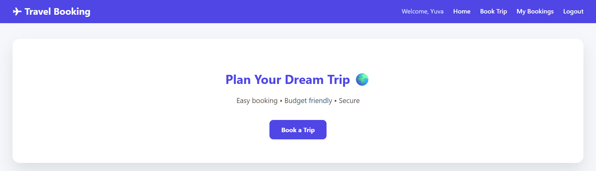

# ✈️ Travel Booking — Django Travel Management Website

A simple and functional **Travel Booking web application built with Django**.

This project is the **third project in my Django Learning Project series**, where I am learning Django concepts by building small practical applications instead of studying each topic only as separate exercises.

The project focuses on understanding how different Django concepts work together in a complete web application — from user authentication and models to views, URL routing, templates, database operations, and CRUD functionality.

---

## 📌 Project Series

This repository is part of my ongoing **Django Learning Project**.

**Project 3 — Django Travel Booking Application**

This is the third project in the series.

This project is part of my ongoing **Django Learning Project Series**, where I build small practical applications to understand different Django concepts through implementation.

The goal of this project is to understand how Django can be used to build a database-driven web application with **user authentication and travel booking CRUD operations**.

The series currently includes:

1. **Django To-Do Application** ✅
2. **Django FunQuiz 🎮** ✅
3. **Django Travel Booking ✈️** ✅

More Django projects will be added as I continue learning and applying different Django concepts.

---

## 🚀 Project Overview

The Django Travel Booking application allows users to:

* Register a new account
* Log in to the application
* Log out from the application
* Access the home page after authentication
* Create a new travel booking
* Enter traveller and trip details
* Store booking information in the database
* View their bookings
* Update existing booking details
* Delete existing bookings
* Navigate between different pages using Django URL routing

The application demonstrates how Django connects the:

**User → URL → View → Model → Database → View → Template**

workflow into a working web application.

---

## ✨ Features

### 👤 User Registration

New users can create an account using the registration page.

The registration process allows users to enter their account details and create a Django user account.

After successful registration, the user can log in to the application.

---

### 🔐 User Login

Registered users can log in using their username and password.

Django's built-in authentication system is used to validate the login credentials.

After successful login, the user can access the main Travel Booking application.

---

### 🚪 User Logout

Authenticated users can log out from the application using the **Logout** option.

After logging out, the authenticated session is ended.

---

### 🏠 Home Page

The home page acts as the main page of the Travel Booking application after login.

The navigation bar provides access to:

* Home
* Book Trip
* My Bookings
* Logout

The page also provides a **Book a Trip** option for creating a new travel booking.

---

### 🧳 Book a Trip

Users can create a new travel booking through the booking form.

The form collects travel and traveller information such as:

* Name
* Age
* From location
* Destination
* Duration
* Budget

The submitted information is stored in the database.

---

### 📝 Travel Booking Form

The booking form allows users to enter their trip details before confirming the booking.

Example:

```text
Name        : Yuvashree
Age         : 22
From        : Bangalore
Destination : Chennai
Duration    : 3
Budget      : ₹3000
````

After entering the required information, the user can select **Confirm Booking**.

---

### 🎉 Booking Successful

After successfully submitting the travel booking, the application displays a booking confirmation page.

The confirmation page informs the user that the booking was successfully completed.

It also displays the user's name and provides a **Back to Home** option.

---

### 📋 My Bookings

The **My Bookings** page displays the bookings created by the logged-in user.

Each booking contains information such as:

* From location
* Destination
* Traveller name
* Age
* Duration
* Budget

Each booking also provides:

* Edit
* Delete

options.

---

### ✏️ Edit Booking

Users can update an existing travel booking.

The selected booking information is loaded into the booking form, allowing the user to modify the existing details.

The updated information is then saved back to the database.

---

### 🗑️ Delete Booking

Users can delete an existing travel booking from the **My Bookings** page.

After deletion, the selected booking is removed from the database.

---

### 🔒 User Authentication

The application uses Django's authentication system to manage logged-in users.

Authentication is used to control access to application pages and associate bookings with the currently logged-in user.

---

### 🗄️ Database Storage

Travel booking information is stored in the database using Django models.

The project uses Django ORM to create, retrieve, update, and delete booking records.

---

## 🛠️ Technologies Used

### Backend

* Python
* Django

### Frontend

* HTML
* CSS
* Django Templates

### Database

* SQLite

### Authentication

* Django Authentication System

### Development Tools

* Visual Studio Code
* PowerShell
* Git
* GitHub

---

## 🧠 Django Concepts Covered

This project was created to practice multiple Django concepts together.

### 1. Django Project Structure

Understanding the difference between a Django project and a Django application.

The Django project contains the main configuration files such as:

```text
settings.py
urls.py
asgi.py
wsgi.py
```

---

### 2. Django Application

The application contains the main logic required for the Travel Booking system.

It includes components such as:

* Models
* Views
* URLs
* Templates
* Migrations
* Admin configuration

---

### 3. User Authentication

The project uses Django's built-in authentication system for managing users.

Authentication functionality includes:

* User registration
* User login
* User logout
* Authentication sessions
* Login-protected pages

---

### 4. Models

Django models are used to represent travel booking information.

The booking model stores information such as:

* User
* Name
* Age
* From location
* Destination
* Duration
* Budget

The model is connected to the database through Django ORM.

---

### 5. Django ORM

The project uses Django ORM to perform database operations without writing raw SQL for normal application operations.

ORM is used for:

* Creating bookings
* Retrieving bookings
* Updating bookings
* Deleting bookings

User-specific booking records can also be retrieved through ORM queries.

---

### 6. Migrations

Django migrations are used to create and modify the database structure.

Migration files are maintained inside the application's:

```text
migrations/
```

folder.

The database structure can be created using:

```bash
python manage.py migrate
```

---

### 7. Views

Django views handle the main application logic.

The views are responsible for operations such as:

* User registration
* User login
* User logout
* Displaying the home page
* Creating bookings
* Displaying bookings
* Updating bookings
* Deleting bookings
* Redirecting users between pages

---

### 8. URL Routing

The URL configuration connects browser requests to Django views.

/              → Landing
/login/        → Login
/register/     → Registration
/home/         → Home
/form/         → Booking
/bookings/     → Booking List
/edit/<id>/    → Edit
/delete/<id>/  → Delete
/logout/       → Logout

---

### 9. Django Templates

Django templates are used to create the application's user interface.

Templates are responsible for displaying:

* User information
* Booking information
* Forms
* Navigation
* Success messages
* Dynamic booking data

Example:

```django

```

Reusable content can be placed inside template blocks:

```django



```

---

### 11. CSRF Protection

Django's CSRF protection is used for forms that submit data using POST requests.

Forms use:

```django

```

This helps protect form submissions against Cross-Site Request Forgery attacks.

---

### 12. CRUD Operations

The Travel Booking application demonstrates the basic CRUD operations.

| Operation | Function                    |
| --------- | --------------------------- |
| Create    | Create a new travel booking |
| Read      | View existing bookings      |
| Update    | Edit an existing booking    |
| Delete    | Delete an existing booking  |

---

🏗️ System Architecture

The project follows the basic Django Model-View-Template architecture.

                ┌──────────────────────┐
                │       Browser        │
                └──────────┬───────────┘
                           │
                           ▼
                ┌──────────────────────┐
                │    Django URLs       │
                │      urls.py         │
                └──────────┬───────────┘
                           │
                           ▼
                ┌──────────────────────┐
                │       Views          │
                │      views.py        │
                └───────┬───────┬──────┘
                        │       │
              ┌─────────┘       └─────────┐
              ▼                           ▼
     ┌─────────────────┐         ┌─────────────────┐
     │     Models      │         │    Templates    │
     │    models.py    │         │      HTML       │
     └────────┬────────┘         └─────────────────┘
              │
              ▼
     ┌─────────────────┐
     │   SQLite DB     │
     │   db.sqlite3    │
     └─────────────────┘

--- 

## 📂 Project Structure

```text
django-travel-booking/

│
├── .gitignore
├── manage.py
│
├── screenshots/
│   ├── booking-form.png
│   ├── booking-success.png
│   ├── home.png
│   ├── landing.png
│   ├── login.png
│   └── register.png
│
├── accounts/
│   ├── __init__.py
│   ├── admin.py
│   ├── apps.py
│   ├── models.py
│   ├── tests.py
│   ├── urls.py
│   ├── views.py
│   │
│   ├── migrations/
│   │
│   └── templates/
│
└── travel_project/
    ├── __init__.py
    ├── asgi.py
    ├── settings.py
    ├── urls.py
    └── wsgi.py
```

---

## 🔄 Application Flow

The basic flow of the application is:

```text
User
  ↓
Landing Page
  ↓
Register / Login
  ↓
Home Page
  ↓
Book a Trip
  ↓
Booking Form
  ↓
Submit Booking
  ↓
Django View
  ↓
Django Model
  ↓
SQLite Database
  ↓
Booking Saved
  ↓
Booking Successful
  ↓
My Bookings
  ↓
Edit / Delete
```

### Booking Flow

When a user creates a booking:

```text
User enters travel details
        ↓
Booking Form
        ↓
POST Request
        ↓
Django View
        ↓
Django Model
        ↓
SQLite Database
        ↓
Booking Saved
        ↓
Booking Successful Page
```

---

## 🖥️ Application Pages

### Landing Page

The landing page provides the entry point to the Travel Booking application.

It introduces the application and allows the user to proceed to the booking system.

### Register

New users can create their account using the registration page.

### Login

Registered users can enter their username and password to access the application.

### Home

The home page provides navigation to the main features of the application.

### Book Trip

Users can open the booking form and enter their travel details.

### Booking Form

The booking form collects traveller and trip information before confirming the booking.

### Booking Successful

After successful submission, the user receives a booking confirmation.

### My Bookings

Users can view their existing bookings and perform edit or delete operations.

---

## 📸 Screenshots

The project screenshots are maintained separately inside the:



```text
screenshots/
```

The folder contains individual, separate and remaining screenshots for the different application pages:

```text
booking-form.png
booking-success.png
home.png
landing.png
login.png
register.png
```

The screenshots are intentionally kept separately instead of placing all application screens inside this README. This keeps the repository clean and makes it easier to view each screen individually from the `screenshots/` folder.

Open the **`screenshots/`** folder in the repository to view these screens individually.

---

## 🧪 Testing

The project currently contains the Django test module:

accounts/tests.py

Additional automated tests can be added for:

-- User registration
-- Login
-- Logout
-- Booking creation
-- Booking retrieval
-- Booking update
-- Booking deletion
-- Unauthorized access
-- User-specific booking access

---

## ⚙️ How to Run the Project

### 1. Clone the Repository

```bash
git clone YOUR_GITHUB_REPOSITORY_URL
```

### 2. Open the Project Folder

```bash
cd django-travel-booking
```

### 3. Create a Virtual Environment

```bash
python -m venv venv
```

### 4. Activate the Virtual Environment

On Windows:

```powershell
venv\Scripts\activate
```

### 5. Install Django

```bash
pip install django
```

### 6. Apply Migrations

```bash
python manage.py migrate
```

### 7. Start the Development Server

```bash
python manage.py runserver
```

### 8. Open in Browser

Visit:

```text
http://127.0.0.1:8000/
```

---

## 🗃️ Database

The project uses **SQLite** during development.

SQLite is suitable for this learning project because it is lightweight and does not require a separate database server.

The database structure is managed using Django migrations.

To apply migrations:

```bash
python manage.py migrate
```

The local database file is excluded from Git using `.gitignore`.

---

## 📚 What I Learned

Through this project, I practiced:

* Django project creation
* Django app creation
* Project and app structure
* User authentication
* User registration
* User login
* User logout
* URL routing
* Views
* Models
* Django ORM
* Database migrations
* SQLite integration
* Django templates
* Template inheritance
* Form handling
* GET and POST requests
* CSRF protection
* CRUD operations
* Creating database records
* Reading database records
* Updating database records
* Deleting database records
* User-specific data
* Authentication-protected pages
* Django development server
* Git version control
* GitHub repository management
* Organizing project documentation

---

## 🎯 Learning Approach

Instead of creating a separate small exercise for every Django topic, I am using **small practical projects to combine multiple concepts together**.

This Travel Booking application is the **third project** in that approach.

The objective is to understand not only individual Django features, but also how authentication, models, views, URLs, templates, databases, and CRUD operations work together inside a complete web application.

---

## 🔮 Future Improvements

Possible improvements for this project include:

* Destination search
* Hotel booking
* Transportation options
* Online payment
* Booking confirmation through email
* User profile
* Travel history
* Admin dashboard
* Map integration
* Improved responsive design
* Deployment

These features can be explored in future Django projects as the learning progresses.

---

## 📌 Project Status

**Status: Completed ✅**

This project is the **third project in my Django Learning Project series**.

The current version successfully implements:

* User registration
* User login
* User logout
* Travel booking
* Booking confirmation
* My Bookings
* Edit booking
* Delete booking
* Database integration
* CRUD operations
* Authentication
* Django URL routing
* Django templates

---

## 👩‍💻 Learning Series

```text
Django Learning Project

        │
        ├── Project 1 → To-Do Application ✅
        │
        ├── Project 2 → FunQuiz 🎮 ✅
        │
        ├── Project 3 → Travel Booking ✈️ ✅
        │
        └── More Projects → Coming Next 🚧
```

This repository is the **third project in my Django Learning Project series**, where I build practical applications to learn and strengthen different Django concepts step by step.

```